# 📚 Documentation Index - @khaveeai/react

Welcome to the complete documentation for the VRM AI Avatar SDK. Choose your path based on what you need:

## 🚀 Getting Started

### New to the SDK?
- **[Quick Start Guide](./QUICKSTART.md)** - Get up and running in 5 minutes
- **[Installation](#installation)** - Detailed installation instructions
- **[Your First Avatar](#your-first-avatar)** - Step-by-step tutorial

### Already familiar?
- **[API Reference](./API.md)** - Complete API documentation
- **[Migration Guide](#migration-guide)** - Upgrading from previous versions

## 📖 Core Documentation

| Document | Description | For Who |
|----------|-------------|---------|
| **[Quick Start](./QUICKSTART.md)** | 5-minute setup guide | Beginners |
| **[API Reference](./API.md)** | Complete API documentation | All developers |
| **[Animation Guide](./ANIMATIONS.md)** | Animation system deep dive | Animation creators |
| **[Development Guide](./DEVELOPMENT.md)** | Development workflows & debugging | Contributors |

## 🎯 Quick Navigation

### Components & Hooks
- [`<KhaveeProvider>`](./API.md#khaveeprovider) - Root configuration provider
- [`<VRMAvatar>`](./API.md#vrmavatar) - Main VRM component
- [`useLLM()`](./API.md#usellm) - LLM integration hook
- [`useVoice()`](./API.md#usevoice) - Text-to-speech hook
- [`useAnimation()`](./API.md#useanimation) - Animation control hook

### Providers
- [Mock Providers](./DEVELOPMENT.md#mock-providers-for-development) - Development without API keys
- [OpenAI Provider](./API.md#llmopenai) - GPT integration
- [Azure Provider](./API.md#ttsazure) - Azure Speech Services

### Animation System
- [Animation Registry](./ANIMATIONS.md#animation-registry) - Defining animations
- [LLM Integration](./ANIMATIONS.md#llm-integration) - AI-triggered animations
- [Manual Control](./ANIMATIONS.md#manual-animation-control) - Direct animation triggers
- [Expressions & Visemes](./ANIMATIONS.md#expression-system) - Facial control

## 📦 Installation

### Core Installation

```bash
# Required packages
pnpm add @khaveeai/react @khaveeai/core

# Peer dependencies  
pnpm add three @pixiv/three-vrm @react-three/fiber @react-three/drei
```

### Provider Packages

```bash
# Development (no API keys needed)
pnpm add @khaveeai/providers-mock

# Production providers
pnpm add @khaveeai/providers-openai     # For OpenAI LLM
pnpm add @khaveeai/providers-azure      # For Azure TTS
```

### Framework Integration

#### Next.js (Recommended)
```bash
npx create-next-app@latest my-vrm-app --typescript --tailwind
cd my-vrm-app
pnpm add @khaveeai/react @khaveeai/core @khaveeai/providers-mock
```

#### Vite
```bash
npm create vite@latest my-vrm-app -- --template react-ts
cd my-vrm-app
pnpm add @khaveeai/react @khaveeai/core @khaveeai/providers-mock
```

#### Create React App
```bash
npx create-react-app my-vrm-app --template typescript
cd my-vrm-app  
pnpm add @khaveeai/react @khaveeai/core @khaveeai/providers-mock
```

## 🎮 Your First Avatar

### 1. Basic Setup

```tsx
// providers.tsx
import { KhaveeProvider } from "@khaveeai/react";
import { MockLLM, MockTTS } from "@khaveeai/providers-mock";

export function Providers({ children }) {
  return (
    <KhaveeProvider config={{
      llm: new MockLLM(),
      tts: new MockTTS(), 
      tools: [],
      animationRegistry: {}
    }}>
      {children}
    </KhaveeProvider>
  );
}
```

### 2. Simple Avatar

```tsx
// Avatar.tsx
import { Canvas } from "@react-three/fiber";
import { VRMAvatar } from "@khaveeai/react";

export default function Avatar() {
  return (
    <div className="h-96">
      <Canvas>
        <VRMAvatar src="/models/avatar.vrm" />
      </Canvas>
    </div>
  );
}
```

### 3. Interactive Chat

```tsx
// Chat.tsx
import { useLLM, useVoice } from "@khaveeai/react";

export default function Chat() {
  const { streamChat } = useLLM();
  const { speak } = useVoice();
  
  const sendMessage = async (text: string) => {
    let response = "";
    for await (const chunk of streamChat({ 
      messages: [{ role: "user", content: text }] 
    })) {
      response += chunk.delta;
    }
    await speak({ text: response });
  };
  
  // ... UI implementation
}
```

## 🎭 Animation Examples

### Quick Animation Test

```tsx
import { useAnimation } from "@khaveeai/react";

function AnimationButtons() {
  const { animate } = useAnimation();
  
  return (
    <div>
      <button onClick={() => animate('wave')}>👋 Wave</button>
      <button onClick={() => animate('dance')}>💃 Dance</button>
      <button onClick={() => animate('thinking')}>🤔 Think</button>
    </div>
  );
}
```

### LLM-Triggered Animations

```tsx
// Animation registry
export const ANIMATIONS = {
  wave: {
    name: "wave",
    description: "Friendly wave gesture",
    tags: ["greeting", "friendly", "hello"]
  },
  dance: {
    name: "dance", 
    description: "Energetic dance moves",
    tags: ["dance", "party", "celebration"]
  }
};

// LLM will automatically trigger animations based on context:
// User: "Hello!" → LLM: "*trigger_animation: wave* Hello there!"
```

## 🔧 Development Workflows

### Mock Development
Perfect for development without API keys:

```tsx
import { MockLLM, MockTTS } from "@khaveeai/providers-mock";

// Zero configuration needed
const config = {
  llm: new MockLLM(),    // Smart contextual responses
  tts: new MockTTS(),    // Simulated speech + lip-sync
  // ...
};
```

### Production Deployment

```tsx
import { LLMOpenAI } from "@khaveeai/providers-openai";
import { TTSAzure } from "@khaveeai/providers-azure";

const config = {
  llm: new LLMOpenAI({ apiKey: process.env.OPENAI_KEY }),
  tts: new TTSAzure({ 
    key: process.env.AZURE_KEY, 
    region: process.env.AZURE_REGION 
  }),
  // ...
};
```

### Hybrid Setup (Recommended)

```tsx
// Automatically falls back to mock if no API keys
const config = {
  llm: process.env.OPENAI_KEY 
    ? new LLMOpenAI({ apiKey: process.env.OPENAI_KEY })
    : new MockLLM(),
  tts: process.env.AZURE_KEY
    ? new TTSAzure({ key: process.env.AZURE_KEY, region: process.env.AZURE_REGION })
    : new MockTTS(),
  // ...
};
```

## 🎯 Use Cases & Examples

### Personal Assistant Avatar
- Conversational AI with personality
- Task reminders and scheduling
- Information lookup and answers

### Educational Companion  
- Language learning with pronunciation
- Subject tutoring with visual aids
- Interactive storytelling

### Customer Service Avatar
- 24/7 automated support
- Product demonstrations
- FAQ assistance with personality

### Entertainment Avatar
- Interactive game characters
- Streaming companion/co-host
- Social media personality

### Business Presentation
- Automated presenters
- Product demos and tutorials
- Training and onboarding

## 🔍 Troubleshooting

### Quick Fixes

| Issue | Solution |
|-------|----------|
| VRM not loading | Check file path, verify CORS headers |
| No animations | Verify animation registry, check console |
| Chat not working | Check provider configuration |
| Performance slow | Optimize VRM, reduce texture sizes |

### Debug Tools

```tsx
// Enable detailed logging
localStorage.setItem('khaveeai:debug', 'true');

// Animation debug panel
import { AnimationDebugPanel } from './AnimationDebugPanel';
<AnimationDebugPanel />

// Provider status check
const { config } = useKhavee();
console.log('LLM:', config.llm.constructor.name);
console.log('TTS:', config.tts.constructor.name);
```

## 📊 Performance Guidelines

### VRM Optimization
- **File size**: Keep under 10MB for web
- **Polygons**: Aim for <20k triangles
- **Textures**: Use 1024x1024 max for web
- **Bones**: Limit to essential bones only

### Animation Performance
- **Concurrent animations**: Limit to 2-3 max
- **Update frequency**: 30-60fps is sufficient
- **Memory**: Preload critical animations

### Bundle Size
- **Core packages**: ~40KB total
- **Providers**: ~10-50KB each
- **Three.js**: Shared dependency (~600KB)

## 🌟 Advanced Topics

### Custom Providers
Implement your own LLM or TTS providers:

```tsx
class CustomLLM implements LLMProvider {
  async *streamChat({ messages }) {
    // Your implementation
  }
}
```

### Animation Scripting
Create complex animation sequences:

```tsx
const playSequence = async () => {
  await animate('wave');
  await delay(1000);
  await animate('thinking');
  await delay(2000);
  await animate('nod_yes');
};
```

### Multi-Avatar Scenes
Multiple avatars in one scene:

```tsx
<Canvas>
  <VRMAvatar src="/avatar1.vrm" position={[-2, 0, 0]} />
  <VRMAvatar src="/avatar2.vrm" position={[2, 0, 0]} />
</Canvas>
```

## 🤝 Contributing

### Development Setup
```bash
git clone <repo>
cd vrm-sdk
pnpm install
pnpm build:packages
pnpm dev:packages
```

### Package Structure
```
packages/
├── core/           # Core types and utilities
├── react/          # React components and hooks
└── providers/      # Provider implementations
    ├── openai/     # OpenAI LLM
    ├── azure/      # Azure TTS
    └── mock/       # Mock providers
```

### Adding Features
1. Create feature branch
2. Add tests
3. Update documentation
4. Submit pull request

## 📄 License & Support

### License
MIT License - see [LICENSE](../LICENSE) file

### Support Channels
- 📖 **Documentation**: This guide and API reference
- 🐛 **Issues**: GitHub issues for bugs
- 💡 **Discussions**: GitHub discussions for questions
- 📧 **Email**: [support@khaveeai.com](mailto:support@khaveeai.com)

### Community
- 🐦 **Twitter**: [@KhaveeAI](https://twitter.com/KhaveeAI)
- 💬 **Discord**: [Join our server](https://discord.gg/khaveeai)
- 📺 **YouTube**: [Tutorial videos](https://youtube.com/@KhaveeAI)

---

## 🗺️ Document Roadmap

```mermaid
graph TD
    A[📚 Index] --> B[🚀 Quick Start]
    A --> C[📖 API Reference]
    A --> D[🎭 Animation Guide]  
    A --> E[🛠️ Development Guide]
    
    B --> F[First Avatar]
    B --> G[Basic Chat]
    
    C --> H[Components]
    C --> I[Hooks]
    C --> J[Providers]
    
    D --> K[Registry]
    D --> L[LLM Integration]
    D --> M[Manual Control]
    
    E --> N[Mock Providers]
    E --> O[Debugging]
    E --> P[Performance]
```



**Happy coding with VRM AI Avatars! 🎉**